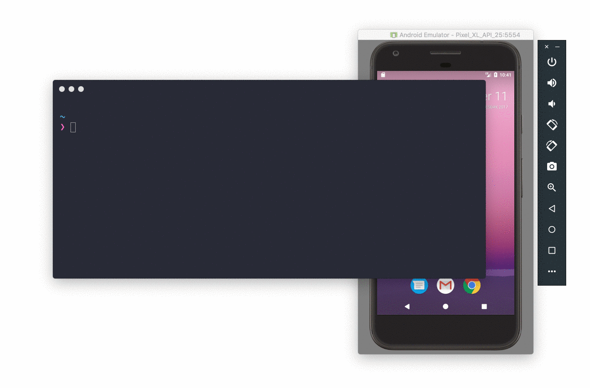

<p align="center"><a href="https://github.com/cesarferreira/goplaces" target="_blank"></a></p>
<h1 align="center">GoPlaces</h1>
<p align="center"><i>GoPlaces</i> to launch apps on your phone/emulator from the terminal</p>
<p align="center">
  <a href="https://travis-ci.org/cesarferreira/goplaces"></a>
  <a href="https://www.npmjs.com/package/goplaces"></a>
  <a href="https://www.npmjs.com/package/goplaces"></a>
  <a href="https://github.com/cesarferreira/goplaces/blob/master/LICENSE"></a>
</p>

<p align="center">
  
</p>


## Install

```sh
npm install -g goplaces
```

## Usage
Connect your android phone or emulator to your computer and run:

```
Usage
   $ goplaces
```

## Created by
[Cesar Ferreira](https://cesarferreira.com)

## License
MIT © [Cesar Ferreira](http://cesarferreira.com)


## Logo
by <a href="http://www.iconka.com">iconka</a>
